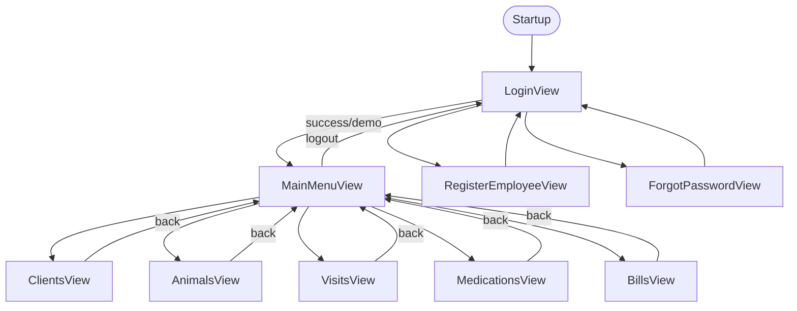

# ClinicVets v2 — Application Route Map (temporary)

Branch: **v2** | Shell: **Avalonia** | Window: **MainWindow** (`MainContent` child swap)

## Startup flow

```
Program.Main
  → AppStability.Initialize()
  → AppServices.Initialize()
  → App.OnFrameworkInitializationCompleted
       → MainWindow
            → LoginView (default)
```

## Auth routes

| Route ID | View | Enter | Exit / back |
|----------|------|-------|-------------|
| `Login` | `LoginView` | App start, logout | Register, Forgot, Demo, Login success → MainMenu |
| `RegisterEmployee` | `RegisterEmployeeView` | Login link | Back → Login; complete → Login + message |
| `ForgotPassword` | `ForgotPasswordView` | Login link | Back → Login; reset → Login + message |
| `MainMenu` | `MainMenuView` | Login success / Demo | Logout → Login |

### Login actions

- **Login** → `AppServices.Auth.LoginAsync` → `MainMenu`
- **Demo** → `AppServices.TryEnterDemoMode` → `MainMenu` (simulated role)
- **Register** / **Forgot password** → sub-pages above

## Feature routes (RBAC-gated)

| Route ID | View | RBAC (`DashboardSection`) | Roles (typical) |
|----------|------|---------------------------|-----------------|
| `Clients` | `ClientsView` | CustomerSearch **or** CustomerRegistration | Admin, Secretary |
| `Animals` | `AnimalsView` | CustomerAnimals | Admin, Secretary, Vet |
| `Visits` | `VisitsView` | Visits | Admin, Vet |
| `Medications` | `MedicationsView` | Treatments | Admin, Vet |
| `Bills` | `BillsView` | Billing | Admin, Secretary |

## Planned / not in shell (no navigation handler)

| Route ID | Status |
|----------|--------|
| `Reports` | Not implemented |
| `Settings` | Not implemented (Admin-only in RBAC) |
| `Treatments` | RBAC only; UI uses `Medications` |

## Navigation diagram



## UI entry points (MainMenu)

**Sidebar:** לקוחות, בעלי חיים, ביקורים וטיפולים, תרופות ומלאי, חשבונות ותשלומים, יציאה  
**Quick-action cards:** same four modules (no Bills card — sidebar only)

## Dialogs / popups

- `UIHelper.ShowMessage` — modal info
- `UIHelper.ShowConfirmation` — yes/no modal
- No separate window routes

## Stability layer

- `AppStability` — file log: `%LocalAppData%\ClinicVets\stability.log`
- `MainWindow.Navigate` — try/catch per route
- `SafeViewLoader` — async data load on feature pages + dashboard
- `Dispatcher.UIThread.UnhandledException` — handled (no process exit)

## Bills page note

Prior v2 builds had **no** `BillsView`; RBAC defined `Billing` but no route → possible crash if an old binary or manual hook referenced a missing page. **v2 now ships `BillsView`** as a safe placeholder (no data load).
